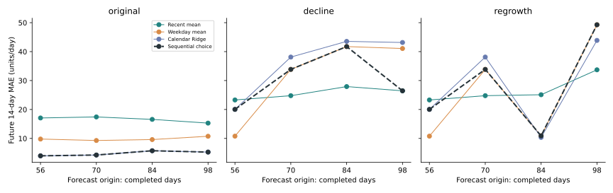

# 事前选方法：选择不是看到结果后再解释

问题：当我们不知道接下来14天销量时，应怎样在三个已有方法中选一个？本次固定一个小规则，再让它面对原趋势、下降突变、下降后重新增长三种教学机制。

## 决策在什么时间形成

规则在执行前固定：从第28天开始每14天做一个历史预测，当前只取最近两个完整结束窗口的平均MAE，选最小者。完全同分按最近均值、同星期均值、日历Ridge顺序；不根据后来成绩改规则。

第一次决策已有56天历史：cutoff=28的窗口覆盖第28~41天，cutoff=42覆盖第42~55天。两者都已完整发生，因此可用于第56天起的预测。第56~69天的成绩要等第69天结束才知道，只能从第70天起参与选择；在第56天决策时，它没有投票权。CSV使用从0起的天编号。

三种机制前56天相同，因此首次选择必须相同；再增长机制到第83天结束前与下降机制相同，因此第84天的选择也必须相同。模型不能预先知道下一天换机制。

最初两个已完成窗口的平均MAE：最近均值16.7857、同星期均值10.3750、日历Ridge4.9999，因此初次选calendar_ridge。这一步不需要知道第56天之后的任何数量。

## 实际选择与未来结果

| 情景 | 已观察天数 | 使用的已完成窗口起点 | 当时选择 | 后来14天MAE |
| --- | ---: | --- | --- | ---: |
| original | 56 | 28|42 | calendar_ridge | 3.9845 |
| original | 70 | 42|56 | calendar_ridge | 4.2651 |
| original | 84 | 56|70 | calendar_ridge | 5.7429 |
| original | 98 | 70|84 | calendar_ridge | 5.2812 |
| decline | 56 | 28|42 | calendar_ridge | 20.0344 |
| decline | 70 | 42|56 | weekday_mean | 33.8571 |
| decline | 84 | 56|70 | weekday_mean | 41.7500 |
| decline | 98 | 70|84 | recent_mean | 26.4592 |
| regrowth | 56 | 28|42 | calendar_ridge | 20.0344 |
| regrowth | 70 | 42|56 | weekday_mean | 33.8571 |
| regrowth | 84 | 56|70 | weekday_mean | 10.8929 |
| regrowth | 98 | 70|84 | weekday_mean | 49.2857 |

[decisions.csv](decisions.csv)把事前理由和事后成绩放在不同字段，[past_scores.csv](past_scores.csv)列出当时可知的每个成绩及可用日期。未来成绩直到future_mae_known_at_date才可用于下一轮；它不参与当前选择。

## 顺序选择是否真的更好

| 方法/固定规则 | 原趋势平均MAE | 下降突变平均MAE | 重新增长平均MAE |
| --- | ---: | ---: | ---: |
| recent_mean | 16.5944 | 25.6122 | 26.7219 |
| weekday_mean | 9.8571 | 31.8661 | 26.2054 |
| calendar_ridge | 4.8184 | 36.2140 | 28.0972 |
| sequential_select | 4.8184 | 30.5252 | 28.5175 |

原趋势中，规则一直选日历Ridge，平均MAE为4.8184。下降情景中，顺序规则平均MAE为30.5252，比固定最近均值25.6122更差；重新增长时，顺序规则为28.5175，也高于固定同星期均值26.2054。因此这条自动选择规则并没有在三个情景中普遍胜出。

顺序选择也有反应延迟：突变发生的第一个窗口，还没有新机制的完整误差可用。后续又可能被两个窗口的平均值拖慢。以上是固定规则的实际成绩，不是挑出每个未来窗口事后最佳方法拼成的推荐；顺序规则是否值得用，需要看它相较固定方法在哪些窗口改善、在哪些窗口变差。这里不增加模型，也不凭这三种造数机制推荐线上部署。

如果想尝试只看一个窗口或更长窗口，请先另记规则，再增加未看过的情景比较，不要改完规则后只展示它最有利的同一段数据。

## 怎样复查

从[三套逐日输入](scenario_inputs.csv)检查历史边界；用[逐日预测](predictions.csv)重算[MAE/RMSE](metrics.csv)。每个sequential_select预测应等于当时selected_model的预测。共享预测函数只接收历史数量；测试会保持历史不变、把预测期及之后销量分别改成0、大数和打乱顺序，要求预测与选择不变。测试还故意放入读取未来销量的函数，确认同一个检验会拒绝它。

执行：`python examples/07_sequential_forecast.py`；测试：`python -m unittest tests.test_forecasting -v`。
