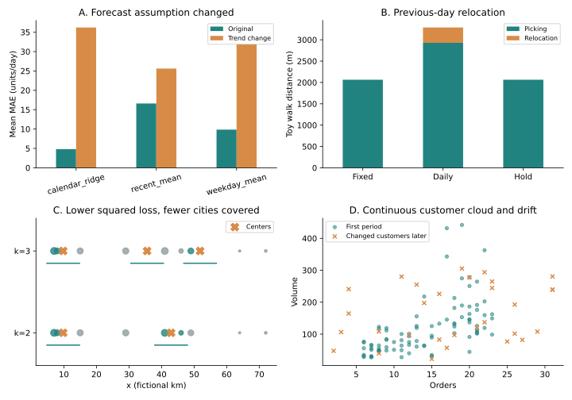

# 四个方法压力练习

先看发生了什么，再决定是否需要换方法。全部为合成教学情景。

## 1. 预测：适合原机制的模型，换机制后会怎样？

| 方法 | 原机制平均MAE | 趋势突变平均MAE |
| --- | ---: | ---: |
| calendar_ridge | 4.8184 | 36.2140 |
| recent_mean | 16.5944 | 25.6122 |
| weekday_mean | 9.8571 | 31.8661 |

前56天相同，后56天改成下降趋势。原机制最好的是calendar_ridge，新机制最好的是recent_mean。这说明日历线性趋势的适用假设出了问题，并不证明某个基线总会赢。先查看哪个窗口开始恶化，再考虑短训练窗、变化检测或更新频率；新增方案仍应在未调参的窗口比较。

重算：[两种输入](prediction_input.csv) → [逐日预测](prediction_predictions.csv) → [逐窗口MAE](prediction_metrics.csv)。MAE是每窗口14个绝对误差的平均，不是除以10。

## 2. 仓储：每天发现波动，不等于每天搬货

| 布局策略 | 拣选行走米数 | 调位行走米数 | 合计米数 |
| --- | ---: | ---: | ---: |
| daily_previous_day | 2928 | 360 | 3288 |
| fixed_two_day | 2064 | 0 | 2064 |
| hold_two_observations | 2064 | 0 | 2064 |

前2天用于初始观察，比较第3~8天。只有1个近位（2米），其他位置10米，每件商品单独往返，换近位额外行走60米。每日策略用昨天最高IQ选今天近位，持有策略需连续两次观察指向同一SKU才换。A/B隔日反转，因此追昨天反而放错近位。这是上述玩具流程的真实计算；真实仓库需改用订单拣选、货位容量与搬运工时。ABC仍按天做诊断，布局应另设观察周期和调整条件，不能从每日类别直接下搬货指令。

重算：[场景参数](warehouse_parameters.json)、[每日数量及ABC](warehouse_demand.csv)、[每次决策与代价](warehouse_operations.csv)。

## 3. 选址：平方距离目标与覆盖目标会冲突

| 连续坐标K-means | 城市覆盖率（5km） | 加权平均距离km | 加权平方损失 |
| --- | ---: | ---: | ---: |
| k=2 | 44.4% | 5.9762 | 32366.52 |
| k=3 | 33.3% | 4.9109 | 15699.89 |

9个固定一维点，各方法使用同一组需求权重。增加中心后平方损失下降，城市覆盖却下降；枚举所有一维连续分段得到相同最优平方损失，因此不能仅归因于初始化。

进一步比较时，先把K-means映射到9个城市候选点（不重复），再与同样候选点、同K、同半径的穷举最大城市覆盖比较。另列候选点平方损失最优解，以分开目标差异和搜索误差。连续坐标原始K-means与离散候选覆盖法约束不同，不能直接用分数判谁更强。最大覆盖法穷举每个组合，以城市覆盖优先，平局依次看需求覆盖和距离。在允许保留旧中心并增加新中心、没有额外冲突约束时，最优覆盖随K不降；这个性质不适用于每次重拟合的K-means覆盖率。

基础12城、100km下：2中心覆盖100.0%、加权平均距离46.46km；3中心覆盖100.0%、距离16.19km。多建一个中心仅在本例减少30.26km平均距离，不知道建站及运输成本就不能判断值不值。若目标只是该半径全覆盖，这次保存的2中心方案已满足，但这不是对所有连续可行方案的最少站数证明。

每日约270km、两日的背景另作两种代理：全部路程用来单程行驶时540km；两日还需完成往返时，单程270km。两者都忽略装卸、多点配送和路网，不能作为两日送达保证。基础12城在270/540km下均已全覆盖，阈值在这组小图上失去区分力，提示正式数据应先核验道路距离和服务模型，而不是追求漂亮覆盖差异。

重算：[点与需求](dc_points.csv)、[中心](dc_centers.csv)、[同约束比较](dc_evaluation.csv)、[基础12城代理情景](base_dc_tradeoffs.csv)。

## 4. 客户：三个簇不等于三个天然等级

90位客户由连续云团生成。第一期K=3轮廓系数0.3422；只跑一次初始化的6个种子与默认分组最小ARI为0.3663。第二期30位客户变化较大，固定第一期模型前后分组ARI为0.4088。这三个指标分别谈形状、初始化和时间变化，不能互相替代。单次初始化与基础例的10次初始化设置不同；低跨期ARI也可能反映真实客户变化，先查看哪些客户改变及原因。

列出固定模型、重拟合中心、固定业务量阈值、重算分位阈值四种路线。重拟合K-means仍用第一期缩放器；否则缩放变化也会混进比较。若客户服务需要稳定等级，要研究调整频率和变化原因，不能仅选择当期轮廓系数最高的方法。简单业务量规则也可作为可解释起点，方法复杂程度不能替代业务检验。

另有5行独立口径对账练习：单位换算、缺值、同口径差额、统计周期不同、一致记录。[对账记录](reconciliation.csv)保留原值，3行待核实；不自动把差额抹平，也不把这个独立例子偷偷拼进90位客户的特征。

重算：[两期特征](customer_features.csv)、[逐客户分组](customer_assignments.csv)、[比较指标](customer_metrics.csv)、[单次初始化分组](customer_seed_assignments.csv)。

## 下一步怎样使用

选一条失败现象，先画出原因，提出一个可以反驳的改进，再留出新窗口比较。本练习展示的是路线改变的依据；正式数据的机制、成本和授权需分别核实。[汇总数字](summary.json)便于检查，逐条CSV才是重算入口。
