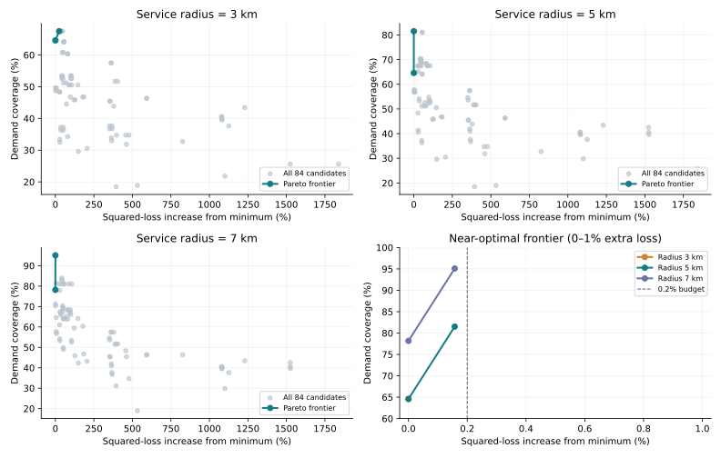

# 选址权衡：多花一点平方损失，能换来多少服务？

先固定问题：九个教学城市既是需求点，也是允许建设的候选位置；选择三个不同中心。三种服务半径各穷举84个方案，改变的是目标与服务阈值，候选位置、距离口径和需求相同。

平方损失是 `Σ(城市需求 × 最近中心距离²)`，单位为需求单位·km²。它惩罚远距离，但不是建站费用、运费或投资回报。需求覆盖是半径内需求占全部需求的比例；城市覆盖则每个城市各算一票，两者不应混用。

## 5公里下，审查提出的权衡确实存在

| 选择目标 | 中心 | 平方损失 | 城市覆盖 | 需求覆盖 | 加权平均距离 |
| --- | --- | ---: | ---: | ---: | ---: |
| 最小平方损失 | P1, P3, P6 | 17156 | 55.56% | 64.59% | 3.684 km |
| 最大城市/需求覆盖 | P1, P3, P5 | 17183 | 66.67% | 81.51% | 3.463 km |

平方损失只增加 **0.1574%**，城市覆盖提高 **11.11个百分点**，需求覆盖提高 **16.93个百分点**，平均距离还下降 **0.220 km**。百分点是两个百分比直接相减，例如60%变成70%是增加10个百分点，并非增加10%。

覆盖方案仍然没有覆盖全部需求。它适合提出一个条件式判断：若企业容许平方损失增加0.2%，并优先服务半径内需求，这个方案更合适；若平方损失必须严格最优，就保留原方案。

## 非支配方案是什么？

把平方损失越小和需求覆盖越大作为两个目标。如果另一方案损失不更大、覆盖不更少，而且至少一项更好，原方案就被‘支配’。找不到这种替代的方案，组成 Pareto（帕累托）前沿。它是一组需要做取舍的候选，不是自动选出的最终答案。城市覆盖和平均距离保留供解释，本次没有把它们偷偷加入支配判断。

| 半径 | 非支配中心 | 平方损失增幅 | 需求覆盖 | 城市覆盖 |
| --- | --- | ---: | ---: | ---: |
| 3 km | P1, P3, P6 | 0.0000% | 64.59% | 55.56% |
| 3 km | P1, P4, P6 | 24.5279% | 67.48% | 55.56% |
| 5 km | P1, P3, P6 | 0.0000% | 64.59% | 55.56% |
| 5 km | P1, P3, P5 | 0.1574% | 81.51% | 66.67% |
| 7 km | P1, P3, P6 | 0.0000% | 78.17% | 66.67% |
| 7 km | P1, P3, P5 | 0.1574% | 95.10% | 77.78% |

## 半径与容忍度改变后，结论并不总是漂亮

下表每格都是：在相对最优平方损失的指定增幅内，选需求覆盖最高的方案。

| 半径 | 0%上限 | 0.2%上限 | 1%上限 | 无增幅上限的最大需求覆盖 |
| --- | --- | --- | --- | --- |
| 3 km | 64.59%（P1, P3, P6） | 64.59%（P1, P3, P6） | 64.59%（P1, P3, P6） | 67.48%（P1, P4, P6） |
| 5 km | 64.59%（P1, P3, P6） | 81.51%（P1, P3, P5） | 81.51%（P1, P3, P5） | 81.51%（P1, P3, P5） |
| 7 km | 78.17%（P1, P3, P6） | 95.10%（P1, P3, P5） | 95.10%（P1, P3, P5） | 95.10%（P1, P3, P5） |

**3公里**时，0.2%和1%的容忍度都没有换来更多需求覆盖；若追求最高覆盖，平方损失要增加 **24.53%**，需求覆盖只提高 **2.90个百分点**。此时保留最小损失方案可能更合理。**7公里**时，0.2%的方案达到95.10%需求覆盖，仍不能写成全部覆盖。服务承诺的半径必须有业务依据，不能为了漂亮结果而调大。

图的前三幅展示全部方案，右下角放大1%增幅内的前沿，避免小差异被横轴范围淹没。连线只辅助阅读，线上的中间位置不代表本候选集存在对应方案。

## 怎样用它做一次事前决定

先确定服务半径、优先覆盖城市还是需求、可容忍的平方损失增幅，再查看对应方案。不要看完结果后挑最有利的目标。在真实项目中，还要把距离替换成适当的道路距离，加入实际候选地址、容量与费用后再检验这组取舍。这里只完成给定候选集的精确比较。

- `all_candidates.csv`：每个半径全部84个方案及非支配标记。
- `selected_plans.csv`：三个单目标方案及三个损失上限方案，含所覆盖城市。
- `pareto_plans.csv`：仅保留两个目标下的前沿。
- `input_points.csv`、`input_record.json`：实际输入、摘要、单位与平局规则。
- `summary.json`：本次结果和5公里的直接差值，报告数字从这些计算生成。

多目标背景：[pymoo官方教程](https://pymoo.org/getting_started/part_3.html)。本例只有84个组合，用穷举即可，不需要遗传算法或安装pymoo。
