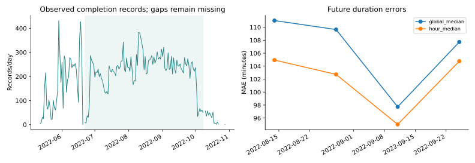

# 配送记录研究：从字段审查到两条路线

输入来自菜鸟公开LaDe吉林配送记录。本次比较完成量与时长两条路线。

## 实际数据先改变了什么

取得31415条记录、4736342字节，无重复运单ID；观察范围内有31415条已完成记录。观察范围内ds与完成日期有19条不同，所以完成量按delivery_time日期统计。完成日期区间内6天无记录，空日含义不明，没有补零。最长连续观察段为2022-06-22至2022-10-08，共109天。

年份口径：2022；官方固定版本的2022来自作者说明。文件与字段核查见[data_audit.json](data_audit.json)。逐日记录图的断线表示没有记录，不表示业务量为零。

## 路线一：预测已记录完成量

连续段按观察范围的日期覆盖情况选定，评价它最后4个14天窗口；这是该观察段的回测。每次只用更早日期预测；顺序选择仍采用最近两个已完成窗口平均MAE最小，历史不足两个时只使用已有完整窗口。[选择记录](volume_choices.csv)保存当时可用日期及历史成绩。

| 方法 | 窗口平均MAE（记录/天） |
| --- | ---: |
| calendar_ridge | 86.3442 |
| recent_mean | 48.0128 |
| sequential_select | 64.8931 |
| weekday_mean | 50.8214 |

[逐日预测](volume_predictions.csv)与[窗口结果](volume_metrics.csv)可以重算。这个目标测量文件中完成记录的条数；它不覆盖取消单、未完成单或平台之外的需求。尾部下降无法仅凭此文件区分真实业务变化与采样变化，当前不给排班或库存收益结论。

## 路线二：接单时预测完成时长

比较已完成历史的总体中位数与接单小时中位数，小时组少于30条时回退总体值。两法使用相同历史和未来运单，训练要求接单和完成时间均早于窗口起点。模型在起点冻结，到每张运单接单时读取当时可见的小时；未来完成时间仅在评分时使用。极长样本保留，另列超过6小时的误差。

| 方法 | 全部测试运单MAE（分钟） |
| --- | ---: |
| global_median | 106.5506 |
| hour_median | 101.6358 |

按小时分组相对总体中位数的MAE变化为4.61%（正数表示减少）。改进后的全部运单误差仍为101.64分钟；超过6小时的运单，按小时分组误差仍为270.36分钟。接单时段是否有预测价值需要逐窗口和后续数据确认。查看[逐窗口与长尾结果](duration_metrics.csv)，确认改善是否只集中于某一时段；[逐条时长预测](duration_predictions.csv)不含原运单、配送员ID与坐标。[按接单小时、日期与长尾分组](duration_diagnostics.csv)可定位改善或退步集中在哪些对象；其中长尾分组仅用于事后诊断，预测时不能预知实际时长。时长包含接单后的等待和作业，不能当成两点之间纯行驶时间。

## 现在怎样选择继续研究的方向

完成量路线首先卡在记录覆盖口径，继续堆预测模型无法解释月底断档。下一步需要数据方说明采样与业务覆盖，才能把预测连接到业务决策。时长路线可以继续查接单时段与长尾的关系，但是否能据此改善服务，还要补批次、承诺时限或独立后续数据。两条路线的误差单位不同，不直接排名。

继续研究时先检查每个窗口的改善是否保持，再决定增加特征或模型。保留完成量基线及它暴露的数据问题；路线取舍需结合提供者的业务口径。

## 复现与答辩

从仓库根目录运行 `python research/lade-jilin/run.py --download`；已有官方文件可用 `--data /path/to/delivery_jl.csv`。自有数据用`--custom-data --data /path/to/records.csv --output-dir outputs/my-delivery`；完整时间含年份，缺年份时显式加`--year`。窗口和观察日期见[参数](summary.json)。官方模式核对固定SHA256；自有模式记录实际SHA256和来源类型。

> 为什么不把没记录的天填成0？
> 因为数据没有说明缺记录等于零业务。我们选择连续可观察段评分，并把覆盖口径列为下一步最需要的材料。

> 分组误差降低，就能说提高配送效率吗？
> 还不能。目前只是接单时长预测的误差对照，尚未改变配送策略，也没有测量服务收益。

输入来源类型、实际摘要和字段检查见[data_audit.json](data_audit.json)。

来源：[官方数据卡](https://huggingface.co/datasets/Cainiao-AI/LaDe)、[作者时间范围说明](https://github.com/wenhaomin/LaDe)。数据卡标Apache-2.0与研究用途；引用Wu等，*LaDe: The First Comprehensive Last-mile Express Dataset from Industry*, KDD 2024, DOI 10.1145/3637528.3671548。
