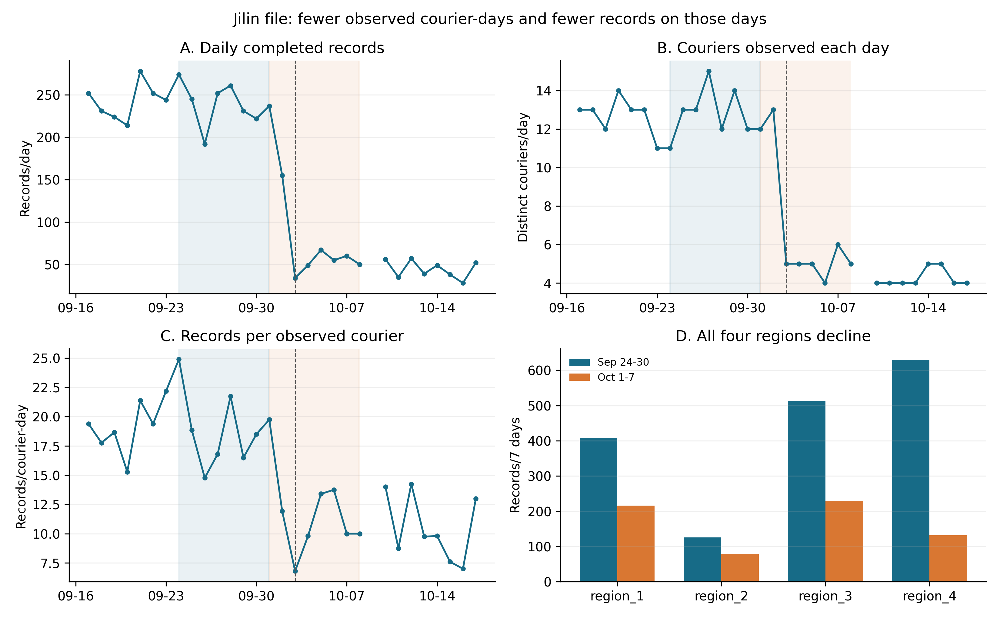
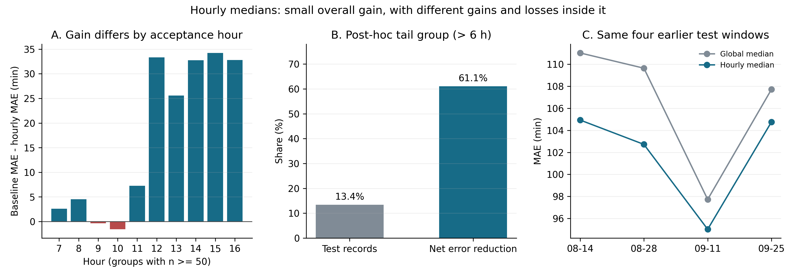

# 吉林配送二轮研究：记录量突降发生在哪里，小时预测为什么改善

**记录量的下降主要发生在两期共同出现的配送员身上；时长预测的长尾改善可以被预测值移动精确解释。** 这推进了首轮的判断：现在可以定位文件结构如何变化，也能说明误差改善的算术来源；仍需业务或采样材料来解释作业原因。

本次是看过首轮结果后的描述性分析，未训练新模型。来源与字段适用范围集中见[证据说明](../../../../docs/research/evidence.md)；原来的[建模前计划](../../plan.md)、[第一次改判](../../before-model.md)及失败的顺序选模结果保留。

## 输入与比较口径

原始 `delivery_jl.csv` 有 31,415 行、17 列、57 名配送员、4 个区域ID，无重复运单ID。接单日期覆盖 2022-05-12 至 2022-10-28，完成日期覆盖 2022-05-12 至 2022-10-28。核心时间和ID字段无缺失；接单GPS经纬度各缺 955 条，本次不用GPS推断路线。全部输入有 19 条跨日完成；`ds` 与接单日期全部相同，与完成日期有 19 条不同，因此完成量直接按完成时间统计。

主比较选9月24—30日和10月1—7日，两期各7天且星期构成相同。文件中每天均有记录；敏感性比较另列。城市整日没记录时保留缺失，不能视为零需求。匿名区域序号按原 `region_id` 的字符串排序，表示文件内分组，不对应已确认的行政区。

时长分析复用首轮四个14天窗口的 25,882 行预测，配对成 12,941 个相同对象。按窗口与样本序号回连原始行顺序，核对实际时长、接单日期和小时后，才计算组间差异。输入及代码摘要、运行环境见[summary.json](summary.json)。

## 记录量：每天出现的配送员少了，每人出现当天的条数也少了

| 完成日口径 | 9月24—30日 | 10月1—7日 |
| --- | --- | --- |
| 文件记录数 | 1677 | 657 |
| 日均记录数 | 239.57 | 93.86 |
| 比较期内出现过的配送员数 | 18 | 17 |
| 配送员日总数 | 90 | 50 |
| 日均活跃配送员数 A | 12.86 | 7.14 |
| 每配送员日记录数 P | 18.63 | 13.14 |

一个配送员出现两天，计2个“配送员日”。例如每天10人、每人20条，日均是200条。这里 **A = 配送员日总数 / 天数，P = 总记录数 / 配送员日总数**，所以日均记录数严格等于 A×P。P是文件内的记录强度，不能当作员工真实效率；活跃指在文件中出现过，不是完整在岗人数。

日均记录数减少 145.71 条（60.82%）。将两个同时变化的因素对称分解：

`Δ日均记录数 = ΔA × (P前 + P后)/2 + ΔP × (A前 + A后)/2`

A项为 -90.78 条/天，占降量 62.30%；P项为 -54.93 条/天，占 37.70%。这是恒等式分解，给出数量来源，不把两项称为因果解释。逐项结果见[volume_comparisons.csv](volume_comparisons.csv)。

**前期有记录、后期整期无记录的配送员集合，并非主要降量来源。** 两期共同的13名配送员，记录从 1,528 条降到 479 条（减少 1,049 条），配送员日从 73 降至 37，每配送员日从 20.93 降到 12.95。前期独有5名的149条未再出现，后期独有4名带来178条，两类集合变化净增加29条。共同集合也可能有人在10月初停止出现；两期累计人数接近，无法替代每日出现频率的比较。见[配送员集合聚合](volume_courier_cohorts.csv)。

10月1、2、3日的记录数分别是237、155、34条，日活跃人数分别是12、13、5。9月末出现过的18名配送员中，7 名在整个文件中的最后记录集中在10月2日。这提示应优先向数据方核对这一天附近的采样覆盖和任务变化；不能仅凭“最后出现”说他们离职。见[逐日表](volume_daily.csv)和[最后出现日期分布](volume_last_seen.csv)。



## 区域：四组均下降，重新分配区域权重不能解释记录强度下降

| 匿名区域 | 前期条数 | 后期条数 | 对总降量的占比 | 每配送员日条数：前→后 |
| --- | --- | --- | --- | --- |
| region_1 | 408 | 216 | 18.82% | 21.47 → 14.40 |
| region_2 | 126 | 79 | 4.61% | 7.41 → 11.29 |
| region_3 | 513 | 230 | 27.75% | 24.43 → 19.17 |
| region_4 | 630 | 132 | 48.82% | 19.09 → 8.25 |

region_4贡献最多的降量，但四个区域都减少。全输入的配送员ID均只关联一个区域，本次两期共同配送员没有换区域；区域贡献可以相加，不能把它说成已识别的地区业务损失。

再检查“只是低条数组的占比变多”这一解释：用各区域配送员日占比 w 加权区域内条数 p，城市 P = Σw×p。对称分解得到，P的变化 -5.4933 条/配送员日中，**区域权重变化贡献 +0.6447，区域内条数变化贡献 -6.1380**。权重变化反而略微抵消下降，因此单纯的区域配比变化不足以解释它；这里仍没有控制区域内配送员和任务组成。明细见[区域对比](volume_region_comparisons.csv)。

按接单日重算，两期总条数仍是1,677和657，下降比例相同，A项占 63.45%。这使“完成日期挪动造成下降”的解释缺少支持，但两种日期都来自同一份已完成记录，接单量也不等于完整新增需求。

| 前期 / 后期 | 条数变化 | A项占降量 |
| --- | --- | --- |
| 09-24—09-30 / 10-01—10-07 | -60.82% | 62.30% |
| 09-17—09-23 / 10-01—10-07 | -61.24% | 60.46% |
| 09-25—09-30 / 10-01—10-06 | -57.45% | 68.02% |
| 09-24—09-30 / 10-02—10-08 | -71.97% | 57.56% |

三个同星期构成的7天比较均有下降，A项占比约57.6%—62.3%；6天比较的星期构成不同，仅作日期边界检查。比较窗口是事后选择，不能称为预先设计的变化检验。

## 时长：上午的长尾改善和下午的普通任务改善来自不同方向

总体MAE从 106.55 降至 101.64 分钟，减少 4.91 分钟（4.61%）。两法误差相减后，总绝对误差减少 63,601.5 分钟；它是预测误差累计差，不是节省的配送作业时间。

实际时长>6小时的 1,732 条占测试对象 13.38%，贡献净误差减少量的 61.07%，每条平均改善 22.42 分钟，小时法的MAE仍有 270.36 分钟。≤6小时的 11,209 条每条仅平均改善 2.21 分钟。长尾由真实标签事后划分，接单时不能读取该标签。见[配对分组结果](duration_groups.csv)。

**这61%的贡献，并不说明小时法预测出了极端慢单。** 所有预测值最高只有 206 分钟，长尾实际值均大于两预测。若实际值y大于两预测a、b，则 `|y-a| - |y-b| = b-a`；长尾每条误差变化恰好等于小时预测相对总体预测的位移，与它到底多慢无关。

例如8月14日起的窗口，8时总体预测167分钟、小时预测195分钟。316条长尾每条均改善28分钟，共8,848分钟；同小时预测只是对所有任务一起上移。位于167分钟以下的快任务则每条增加28分钟误差，两预测之间的对象另按实际距离变化。[duration_loss_geometry.csv](duration_loss_geometry.csv)逐窗口逐小时核对这条恒等式。

拆成时段后，7—9时的 1,645 条长尾占全部长尾 94.98%，合计改善 39,889 分钟；同时间的 9,559 条普通任务反而合计退步 10,084 分钟。13—15时的 787 条普通任务通过预测下移，合计改善 24,847 分钟、平均 31.57 分钟。因此不能把不同人群的改善归为一个已证实的慢单机制。

| 接单小时 | 对象数 | 总体中位数MAE | 小时中位数MAE | 平均改善（分钟） |
| --- | --- | --- | --- | --- |
| 7 | 1817 | 97.41 | 94.80 | +2.60 |
| 8 | 5798 | 110.36 | 105.82 | +4.54 |
| 9 | 3589 | 106.47 | 106.82 | -0.35 |
| 10 | 577 | 104.20 | 105.78 | -1.58 |
| 13 | 353 | 101.73 | 76.13 | +25.60 |
| 14 | 256 | 102.74 | 70.00 | +32.74 |
| 15 | 193 | 93.75 | 59.52 | +34.23 |

## 可以继续验证的作业线索，以及目前稳定性的边界

实际时长中位数：8时 212 分钟、9时 172 分钟、13时 82 分钟。12,941 个对象中，12,939 条当天完成，仅 2 条跨日。故测试长尾主要是同日耗时长，不能简单归因于跨夜。

8、9、10时三个组的接单时钟中位数分别为 8:37、9:17、10:12，完成时钟中位数却较接近：12:06、12:13、12:26。这是核查作业批次或等待的线索，尚不能认定存在午间完成截止。各时段完成时钟分布见[duration_completion_clock.csv](duration_completion_clock.csv)；这些是分别计算的时钟中位数，其差不能代替时长中位数。

下午对象组成集中：13时最大单一配送员占 58.64%，最大区域占 67.14%；8时对应为 14.90% 和 34.20%。所以先检查任务构成，不能直接把下午短时长归因于某种配送安排。

相同配送员内比较13时与8时，各时段各至少5条的共同组有 6 个，覆盖13时对象 94.62%，按13时对象数加权的组内中位数差为 -70.38 分钟，全部共同组的13时中位数较短。把范围再缩到同配送员同一天、两时段各至少3条，只覆盖 28.90% 的13时对象，组内差为 -63.53 分钟。这给出一个局部线索：更换配送员ID本身不足以描述已覆盖组里的全部差异。它没有控制批次、路线、任务类型或等待，也没有证明接单小时的因果作用。两个组内统计与总体中位数差不是同一种估计量，不用差额估算组成“解释了多少”。见[组成对照](duration_composition_contrasts.csv)及[各小时画像](duration_hour_profiles.csv)。

| 14天窗口起点 | 对象数 | 全部对象平均改善 | ≤6小时对象平均改善 |
| --- | --- | --- | --- |
| 2022-08-14 | 3700 | +6.09 | +2.95 |
| 2022-08-28 | 3686 | +6.92 | +4.35 |
| 2022-09-11 | 3446 | +2.71 | +0.76 |
| 2022-09-25 | 2109 | +2.96 | -0.33 |

四个窗口的总体误差均改善，但后两个改善较小；最后一个窗口的普通任务平均改善为 -0.3341 分钟，已经退步。56个测试日期中5日退步：2022-09-18, 2022-09-19, 2022-09-20, 2022-09-22, 2022-09-29。这仅描述先前已评分的四窗口，不是新增独立验证；这些窗口也是提出本次线索的材料。10月9日以后的记录稀疏且有缺日，不用它来声称后续稳定性。当前支持保留小时中位数为对照方法，还不支持稳定服务收益或部署结论。



## 研究决定和能推翻它的证据

| 当前判断 | 下一份材料直接检验什么 | 哪种结果会改变判断 |
| --- | --- | --- |
| 记录下降主要在共同配送员的出现频率和记录强度中，不能归结为累计人数减少 | 核对10月2—3日前后的采样规则、完整每日接单/完成记录及在岗名单；重复上述分解 | 完整覆盖数据没有同样下降，则应把本文件异常优先解释为覆盖变化；有同样下降才继续讨论业务变化 |
| 小时中位数描述了时段差异，长尾贡献本身是预测位移的算术结果 | 取得预先未查看的连续后续数据，冻结总体/小时两基线、14天评价窗、30条回退阈值，分别记录7—9时与13—15时、普通和长尾的配对误差 | 总体改善消失或普通任务持续退步，则放弃稳定改善的判断；不能在看到成绩后改时段规则 |
| 下午较短包含同配送员内的差异，但批次/等待机制尚未确认 | 补充预测时可见的任务批次、路线或作业事件时间，在同配送员同日的可比任务上核查 | 差异随任务类型/批次匹配消失，说明小时主要代理任务结构；保留差异也需检验更细作业事件，不能仅凭相关性定因果 |

当前不新增更复杂预测模型。完成量仍保留最近均值MAE48.01条/天、顺序选模64.89条/天的失败对照；新分解没有使自动选模获胜。下一步先核对覆盖与任务事件，再判断特征或模型是否值得增加。本轮没有执行事前选模规则的新实验，也没有取得正式竞赛数据。

## 复现与结果阅读

从仓库根目录运行：

```bash
python research/lade-jilin/run.py --download
python research/lade-jilin/round2/run.py
```

第二条从同一原始CSV和首轮逐条预测重建本目录的表、两幅PNG/SVG及本报告；可用 `--data`、`--predictions`、`--output-dir` 指定相同固定版本的文件位置。文件SHA256证明输入版本对应；回连原始对象、配对重算误差和闭合分解分别核查指定计算。公开结果只含聚合量和匿名区域，不输出原始配送员/运单ID或坐标。

先看主比较及小时损失解释，再用链接CSV核对数值；所有实验边界与来源集中见[证据说明](../../../../docs/research/evidence.md)。
